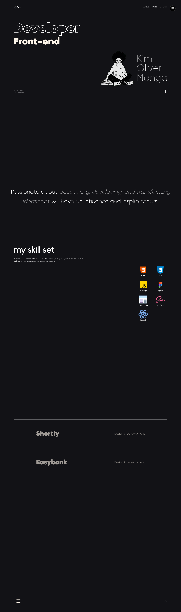
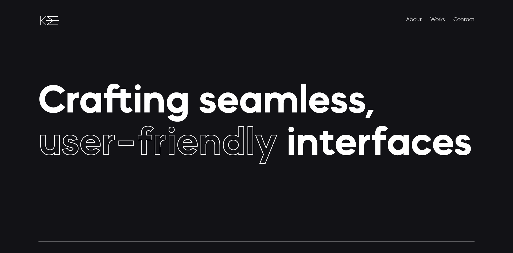
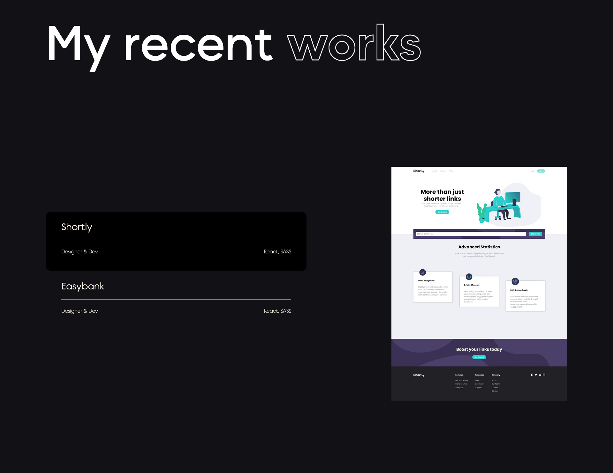
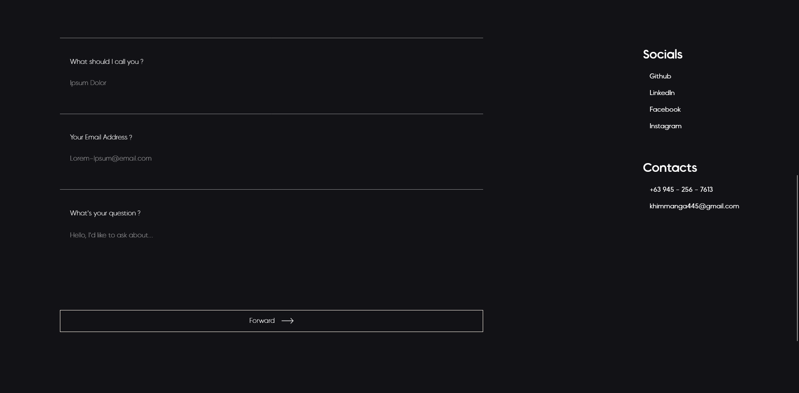

# rttn.Mango

Welcome! This is my personal portfolio website which serves to showcase my skills, projects, and knowledge. Feel free to explore and Thanks for dropping by!

## Table of Contents
- [Overview](#overview)
  - [Screenshot](#screenshots)
- [Installation](#Installation)
  - [Usage](#Usage)
- [Process](#my-process)
  - [Built with](#built-with)
  - [Useful resources](#useful-resources)
- [Author](#author)

## Overview
 - This project is as a way to showcase my skills and recent works.
 - Animations are a big part of the website which is why I highly suggest checking the website itself as what the screenshots will show are extremely limited.

### Screenshots

## Installation
1. Clone the repository by running `git clone https://github.com/rttn-Mango/rttn.Mango.git`;
2. Navigate to the project directory: `cd rttn.Mango`
3. If you already have npm installed, run `npm run dev` on the terminal to run it on your local machine.
4. To install the dependencies, run `npm i` on the terminal
5. If you want to make changes on the SCSS files, either install `Live Sass Compiler Extension` on VS Code or run `sass --watch src/Styles/index.scss src/Styles/index.css` if you have dart sass installed on your local machine.

### Usage
- Customize the contents in each components to your liking.
- Styles folder contains all the styling-related files of the website. 
- `Components` contains thins such as font-faces, custom properties, and also the reset.
- `Pages` contains the styling for other components such as the `Header`, `Footer`, `Preloader`, etc.
- `index` is the main css file.
- Don't forget to update the links and buttons with your social media profiles.

## Process
 - Before I even make the design on figma, I was already looking for resources to use such as typeface, color palette, etc.
 - The initial Idea was to make the project a Single Page App but I decided to add other pages to add more context.
 - Once I felt like I can proceed with the designing process, I started working on the wireframes for the app, Initially It was just for the Homepage as I originally wanted it to just be a singe page app.
 - Once I was done with the wireframes, I proceeded with making the assets that I might use such as the Logo, Icons, etc.
 - After I was done with the assets, I started making the designs for the pages. It started with just the Homepage but I made several revisions along the way and added the designs for About, Works, and Contact Page.
- Once I was satisfied with the design, I then started developing the website based on the design with Mobile-First layout followed by the Desktop Layout and lastly are the Animations.

### Built with

- Semantic HTML5
- CSS custom properties
- Flexbox
- CSS Grid
- Mobile-first
- [React](https://reactjs.org/)
- [Framer-Motion](https://www.framer.com/motion/)
- [GSAP](https://gsap.com/docs/v3/)
- [SASS](https://sass-lang.com/guide/)
- [Figma](https://www.figma.com/)
- [Undraw](https://undraw.co/search)
- [react icons](https://react-icons.github.io/react-icons/#/)
- [Okine Sans Typeface](https://www.behance.net/gallery/146491597/MADE-Okine-Sans-Font)
- [Bodoni Typeface](https://www.dafontfree.io/bodoni-font-free/)

### Useful resources

- [MDN for CSS](https://developer.mozilla.org/en-US/docs/Web/CSS) - Useful resource for verifying syntaxes and such.
- [w3Schools](https://www.w3schools.com/css/) - Similar purpose to mdn.
- [Undraw](https://undraw.co/search) - For Illustrations.
- [Awwwards](https://www.awwwards.com/) - For Website Inspirations.
- [Main Inspiration](https://dennissnellenberg.com/) - Main inspiration for developing this website.
- [Another Inspiration](https://huyml.co/) - Another inspiration for developing this website
- [stackoverflow] - Used to get ideas.

## Author
- Website - (https://mng0.vercel.app)

Feel free to reach out if you have any questions or suggestions. Thanks for dropping by! ٩(◕‿◕｡)۶